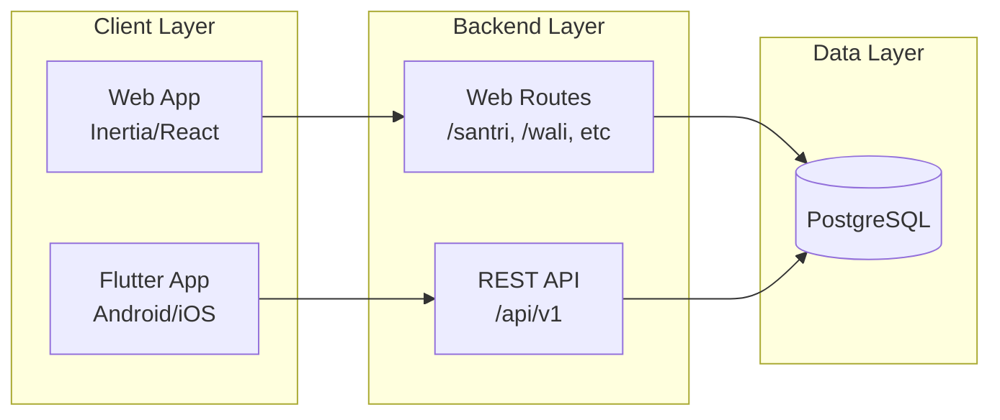
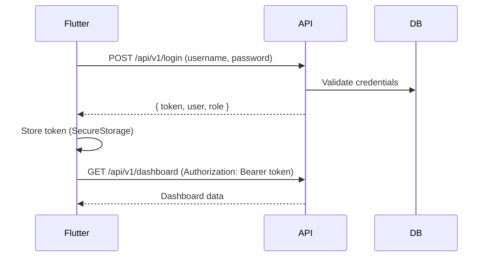

# Rencana Integrasi / Build Flutter App untuk SIAKAD Pesantren

Dokumen ini merencanakan pembangunan aplikasi mobile Flutter yang mengintegrasikan dengan backend Laravel SIAKAD Pesantren yang sudah ada.

---

## 1. Executive Summary

Backend SIAKAD Pesantren saat ini berbasis Laravel dengan frontend web (Inertia/React). Untuk memperluas aksesibilitas ke platform mobile (Android/iOS), direncanakan pembangunan aplikasi Flutter yang mengonsumsi data dari backend yang sama melalui REST API.

**Arsitektur High-Level:**



- **Web App**: Tetap menggunakan Inertia + session auth (tidak berubah).
- **Flutter App**: Mengonsumsi REST API dengan token-based auth (Laravel Sanctum).
- **Backend**: Satu codebase Laravel melayani web dan API.

---

## 2. Kondisi Backend Saat Ini

| Aspek | Status |
|-------|--------|
| Framework | Laravel 12 |
| Frontend Web | Inertia.js + React + Vite |
| Auth | Session-based (cookies), username + password |
| 2FA | Laravel Fortify (TOTP) |
| Routes | Semua di `routes/web.php`, tidak ada `routes/api.php` |
| Response Format | Inertia (HTML/JSON hybrid) untuk web, JSON untuk beberapa endpoint (e.g. notifications) |

**Endpoint yang sudah return JSON:**
- `GET /notifications` – daftar notifikasi
- `POST /notifications/{id}/read` – tandai dibaca
- `POST /notifications/read-all` – tandai semua dibaca
- `POST /payment/snap-token` – token Midtrans (untuk web payment)

**Modul yang perlu diekspos ke API:**
- Auth (login, logout)
- Dashboard (per role)
- Santri: grades, tahfidz, violations, profile
- Wali: children, invoices, payment history, upload proof
- Guru/Wali Kelas: kitab grades, report cards (terbatas)
- Notifikasi

---

## 3. Backend Requirements untuk Flutter

### 3.1 Laravel Sanctum
- Tambahkan `laravel/sanctum` untuk API token authentication.
- Buat guard `sanctum` untuk request dari mobile.
- Token disimpan di `personal_access_tokens`; Flutter menyimpan token di Secure Storage.

### 3.2 API Routes
- Buat `routes/api.php` (jika belum ada) atau gunakan Route::prefix di `web.php`.
- Prefix: `/api/v1`.
- Middleware: `auth:sanctum` untuk route yang memerlukan auth.

### 3.3 Endpoint yang Perlu Dibuat
| Modul | Method | Path | Keterangan |
|-------|--------|------|-------------|
| Auth | POST | `/api/v1/login` | Username + password → token |
| Auth | POST | `/api/v1/logout` | Revoke token |
| Auth | GET | `/api/v1/user` | Data user + role |
| Dashboard | GET | `/api/v1/dashboard` | Data sesuai role |
| Santri | GET | `/api/v1/santri/grades` | Nilai kitab |
| Santri | GET | `/api/v1/santri/tahfidz` | Progress tahfidz |
| Santri | GET | `/api/v1/santri/violations` | Pelanggaran |
| Santri | GET | `/api/v1/santri/profile` | Profil santri |
| Wali | GET | `/api/v1/wali/children` | Daftar anak |
| Wali | GET | `/api/v1/wali/children/{id}` | Detail anak |
| Wali | GET | `/api/v1/wali/invoices` | Tagihan |
| Wali | GET | `/api/v1/wali/invoices/{id}` | Detail tagihan |
| Wali | POST | `/api/v1/wali/invoices/{id}/upload-proof` | Upload bukti |
| Wali | GET | `/api/v1/wali/payment-history` | Riwayat bayar |
| Notifikasi | GET | `/api/v1/notifications` | Daftar notifikasi |
| Notifikasi | POST | `/api/v1/notifications/{id}/read` | Tandai dibaca |

### 3.4 Koeksistensi Web dan API
- Web routes tetap memakai session auth.
- API routes memakai Sanctum token.
- Controller dapat dipisah (e.g. `Api/V1/`) atau di-reuse dengan pengecekan request type.

---

## 4. Flutter App Scope (Fase-fase)

| Fase | Target User | Fitur | Prioritas |
|------|-------------|-------|-----------|
| **Fase 1** | Santri | Login, Dashboard, Nilai Kitab, Tahfidz, Pelanggaran, Profil | P0 |
| **Fase 2** | Wali Santri | Login, Data Anak (multi), Tagihan, Riwayat Bayar, Upload Bukti | P0 |
| **Fase 3** | Guru / Wali Kelas | Nilai Kitab (untuk kelas yang diampu), Raport Kelas (input catatan) | P1 |
| **Fase 4** | Opsional | Notifikasi push (FCM), Offline cache, Dark mode | P2 |

**Catatan:**
- Fase 1 & 2 fokus ke pengguna utama (santri & wali).
- Fase 3 untuk guru/wali kelas yang mengisi nilai/catatan lewat mobile.
- Fase 4 bersifat pengayaan UX.

---

## 5. Arsitektur Teknis Flutter

### 5.1 Authentication Flow



### 5.2 Struktur Folder Flutter (Saran)

```
lib/
├── main.dart
├── app.dart
├── core/
│   ├── api/
│   │   ├── api_client.dart      # Dio instance + interceptors
│   │   ├── api_endpoints.dart   # URL constants
│   │   └── api_exceptions.dart
│   ├── auth/
│   │   ├── auth_repository.dart
│   │   └── auth_state.dart
│   ├── storage/
│   │   └── secure_storage.dart
│   └── theme/
├── features/
│   ├── auth/
│   │   ├── login/
│   │   └── splash/
│   ├── dashboard/
│   ├── santri/
│   │   ├── grades/
│   │   ├── tahfidz/
│   │   ├── violations/
│   │   └── profile/
│   ├── wali/
│   │   ├── children/
│   │   ├── invoices/
│   │   └── payment_history/
│   └── notifications/
├── models/
├── providers/   # Riverpod / BLoC
└── widgets/
```

### 5.3 Package Flutter yang Disarankan

| Package | Kegunaan |
|---------|----------|
| `dio` | HTTP client, interceptors, retry |
| `flutter_secure_storage` | Simpan token |
| `riverpod` atau `flutter_bloc` | State management |
| `go_router` | Navigation |
| `freezed` | Data classes, immutability |
| `json_serializable` | Serialisasi JSON |

---

## 6. API Endpoints (Rencana Detail)

### Auth
| Method | Path | Request | Response |
|--------|------|---------|----------|
| POST | `/api/v1/login` | `{ username, password }` | `{ token, token_type, user }` |
| POST | `/api/v1/logout` | - | `{ message }` |
| GET | `/api/v1/user` | - | `{ user, role }` |

### Santri
| Method | Path | Response |
|--------|------|----------|
| GET | `/api/v1/santri/dashboard` | `{ student, recentGrades, activeLeave }` |
| GET | `/api/v1/santri/grades` | `{ grades, semesters }` |
| GET | `/api/v1/santri/tahfidz` | `{ targets, progress }` |
| GET | `/api/v1/santri/violations` | `{ violations }` |
| GET | `/api/v1/santri/profile` | `{ student }` |

### Wali
| Method | Path | Response |
|--------|------|----------|
| GET | `/api/v1/wali/dashboard` | `{ children }` |
| GET | `/api/v1/wali/children` | `{ children }` |
| GET | `/api/v1/wali/children/{id}` | `{ student, grades, tahfidz, violations }` |
| GET | `/api/v1/wali/invoices` | `{ invoices }` (paginated) |
| GET | `/api/v1/wali/invoices/{id}` | `{ invoice }` |
| POST | `/api/v1/wali/invoices/{id}/upload-proof` | FormData: proof_file, amount, notes |
| GET | `/api/v1/wali/payment-history` | `{ payments }` (paginated) |

### Notifikasi
| Method | Path | Response |
|--------|------|----------|
| GET | `/api/v1/notifications` | `[{ id, type, title, message, url, created_at }]` |
| POST | `/api/v1/notifications/{id}/read` | `{ ok }` |
| POST | `/api/v1/notifications/read-all` | `{ ok }` |

---

## 7. Authentication Flow (Detail)

### Login
1. User input username + password.
2. Flutter kirim `POST /api/v1/login`.
3. Backend validasi, buat Sanctum token, return token + user.
4. Flutter simpan token di `flutter_secure_storage`.
5. Redirect ke dashboard.

### Request Terautentikasi
- Header: `Authorization: Bearer {token}`.
- Interceptor Dio: tambahkan header otomatis.
- Jika 401: hapus token, redirect ke login.

### Logout
- `POST /api/v1/logout` untuk revoke token di server.
- Hapus token dari SecureStorage.

### Token Refresh (Opsional)
- Sanctum default: token tidak expire (atau lama).
- Jika pakai expiry: backend kirim refresh_token, Flutter pakai untuk perpanjang akses.

---

## 8. Struktur Proyek

### Opsi A: Repo Terpisah
```
siakad-manhood/          # Laravel (existing)
siakad-manhood-flutter/   # Flutter app (existing)
```
- Kelebihan: CI/CD terpisah, deployment mandiri.
- Kekurangan: Perlu sinkronisasi dokumentasi API.

### Opsi B: Monorepo
```
siakad-manhood/
├── app/
├── routes/
├── ...
└── mobile/              # Flutter app
    ├── lib/
    ├── pubspec.yaml
    └── ...
```
- Kelebihan: Satu repo, dokumentasi API bisa di-share.
- Kekurangan: Ukuran repo bertambah.

**Rekomendasi:** Opsi A (repo terpisah) untuk kemudahan maintenance dan deployment.

---

## 9. Security & Best Practices

| Aspek | Implementasi |
|-------|--------------|
| HTTPS | Wajib di production; API base URL pakai `https://` |
| Token Storage | `flutter_secure_storage` (Keychain/Keystore) |
| Token Expiry | Atur `expiration` di Sanctum; Flutter cek sebelum request |
| CORS | Laravel CORS config untuk domain Flutter (bundle ID / web) jika perlu |
| Validasi Input | Validasi di API layer (Form Request); Flutter validasi di UI |
| Rate Limiting | `throttle:60,1` untuk login; `throttle:api` untuk API umum |
| Logging | Jangan log token; log error untuk debugging |

---

## 10. Timeline & Prioritas

| Fase | Durasi | Deliverables |
|------|--------|--------------|
| **Backend API** | 2–3 minggu | Sanctum, routes api.php, API controllers, dokumentasi Postman/OpenAPI |
| **Fase 1 Flutter (Santri)** | 2–3 minggu | Login, Dashboard, Grades, Tahfidz, Violations, Profile |
| **Fase 2 Flutter (Wali)** | 2 minggu | Children, Invoices, Payment history, Upload proof |
| **Fase 3 Flutter (Guru)** | 1–2 minggu | Kitab grades, Raport kelas (scope terbatas) |
| **Fase 4 (Opsional)** | 1–2 minggu | Push notification, Offline cache |

**Total estimasi:** 8–12 minggu untuk MVP (Fase 1–2).

---

## 11. Referensi & Resources

- [Laravel Sanctum](https://laravel.com/docs/sanctum) – API authentication
- [Flutter HTTP Best Practices](https://docs.flutter.dev/cookbook/networking/fetch-data)
- [Dio Package](https://pub.dev/packages/dio)
- [flutter_secure_storage](https://pub.dev/packages/flutter_secure_storage)
- [Riverpod](https://riverpod.dev/) – State management
- [Midtrans Mobile](https://docs.midtrans.com/docs/mobile-sdk-overview) – Jika perlu integrasi bayar di Flutter

---

## 12. Push Notification (FCM) & Reminder Jadwal

### 12.1 Arsitektur Singkat

- Backend: `kreait/laravel-firebase` + custom `App\Notifications\Channels\FcmChannel`.
- Token device disimpan di tabel `device_tokens` (relasi `User::deviceTokens()`).
- Notifikasi dibangun sebagai `Notification` Laravel dengan `via() = ['database', FcmChannel::class]`, sehingga satu panggilan `Notification::send(...)` mengisi bell-menu aplikasi (database) + push FCM.
- Dua notifikasi utama:
  - `App\Notifications\ScheduleTomorrowNotification` — pengingat jadwal besok untuk Guru/Santri/Wali.
  - `App\Notifications\StudentAbsentNotification` — dipicu saat guru menyimpan kehadiran dengan status `absent`, dikirim ke semua user wali (`Guardian.user_id`) dari santri bersangkutan.

### 12.2 Setup Firebase (one-time)

1. Buat project di [Firebase Console](https://console.firebase.google.com). Aktifkan **Cloud Messaging**.
2. Generate Service Account JSON: `Project Settings > Service Accounts > Generate new private key`.
3. Simpan file ke `storage/app/firebase/service-account.json` di server Laravel (path ini sudah di-`.gitignore`).
4. Set di `.env`:
   ```env
   FIREBASE_CREDENTIALS=storage/app/firebase/service-account.json
   ```
5. Verifikasi dengan `php artisan tinker`:
   ```php
   app(\Kreait\Firebase\Contract\Messaging::class);
   ```
   Tidak boleh throw.

### 12.3 Setup Flutter (one-time)

1. Install CLI: `dart pub global activate flutterfire_cli` (butuh `firebase-tools`).
2. Dari `siakad_manhood_flutter/`:
   ```bash
   flutterfire configure --project=<firebase-project-id>
   ```
   Ini otomatis:
   - Menimpa `lib/firebase_options.dart` dengan nilai real (setelah itu `DefaultFirebaseOptions.isConfigured == true`; sebelum itu FCM di-skip diam-diam).
   - Mengunduh `android/app/google-services.json`.
   - Mengunduh `ios/Runner/GoogleService-Info.plist`.
   - Menambahkan plugin Gradle `com.google.gms.google-services` otomatis.
3. iOS APNs: di Apple Developer, buat **APNs Auth Key (.p8)**, upload ke `Firebase Console > Project Settings > Cloud Messaging > Apple app configuration`.
4. `flutter clean && flutter pub get && flutter run`.

### 12.4 Endpoint API Token

| Method | Path | Payload | Keterangan |
|--------|------|---------|------------|
| POST | `/api/v1/user/fcm-token` | `{ token, platform: android\|ios\|web, device_label? }` | Dipanggil otomatis oleh `FcmService.instance.registerToken()` setelah login. |
| DELETE | `/api/v1/user/fcm-token` | `{ token }` | Dipanggil otomatis saat logout. Juga membersihkan token lewat `FirebaseMessaging.deleteToken()`. |

### 12.5 Reminder Jadwal H-1 (cron)

- Command: `php artisan schedule:remind-tomorrow [--date=YYYY-MM-DD]`.
- Dijadwalkan harian jam 19:00 WIB via `routes/console.php`:
  ```php
  Schedule::command('schedule:remind-tomorrow')
      ->dailyAt('19:00')
      ->timezone('Asia/Jakarta')
      ->onOneServer();
  ```
- Kiriman otomatis dibatch ke queue via `ShouldQueue`. Pastikan worker berjalan.

### 12.6 Production Setup (supervisor + cron)

Tambahkan di crontab server (sebagai user yang punya akses ke folder proyek):

```cron
* * * * * cd /var/www/siakad-manhood && php artisan schedule:run >> /dev/null 2>&1
```

File `/etc/supervisor/conf.d/siakad-queue.conf`:

```ini
[program:siakad-queue]
process_name=%(program_name)s_%(process_num)02d
command=php /var/www/siakad-manhood/artisan queue:work database --sleep=3 --tries=3 --max-time=3600
autostart=true
autorestart=true
user=www-data
numprocs=2
redirect_stderr=true
stdout_logfile=/var/log/siakad-queue.log
stopwaitsecs=3600
```

Reload: `sudo supervisorctl reread && sudo supervisorctl update && sudo supervisorctl start siakad-queue:*`.

### 12.7 Payload FCM Standar

Semua notifikasi yang masuk via `FcmChannel` memakai struktur payload yang sama:

```json
{
  "notification": { "title": "...", "body": "..." },
  "data": {
    "type": "schedule_tomorrow | student_absent",
    "url": "/santri/schedule | /wali/children/{id} | ...",
    "role": "guru | santri | wali",
    "student_id": "...",
    "session_id": "..."
  }
}
```

Flutter `FcmService` membaca `data.url` saat user tap notifikasi (foreground via `flutter_local_notifications`, background/terminated via `onMessageOpenedApp` / `getInitialMessage`) dan melakukan `GoRouter.go(url)`. Route yang sudah didukung:

- `/guru/schedule`
- `/santri/schedule`
- `/wali/children/{id}/schedule`
- `/wali/children/{id}` (student_absent)

### 12.8 Fallback & Keamanan

- Sebelum `flutterfire configure` dijalankan, `DefaultFirebaseOptions.isConfigured == false` → `FcmService.init()` no-op, aplikasi tetap jalan tanpa push.
- Sebelum `FIREBASE_CREDENTIALS` diset, `FcmChannel::send()` skip diam-diam (log debug saja), tapi notifikasi **database** tetap tersimpan, jadi bell-icon di app tetap berfungsi.
- Token FCM yang invalid (`UNREGISTERED` / `INVALID_ARGUMENT`) otomatis dihapus dari `device_tokens` pada setiap `sendMulticast`.

---

*Dokumen ini merupakan rencana strategis dan teknis. Implementasi aktual disesuaikan dengan prioritas dan resource yang tersedia.*
